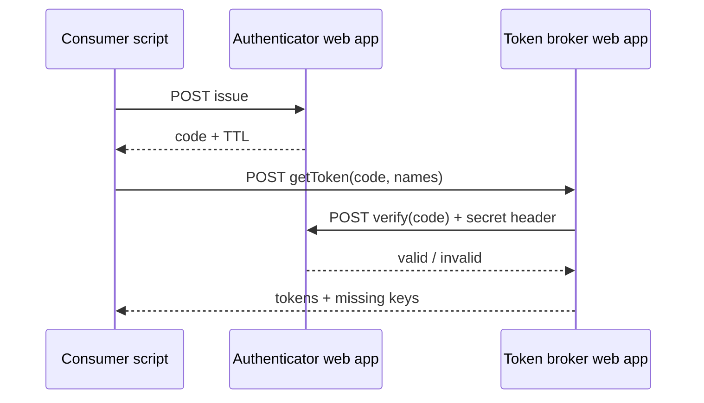

# Token Triangle — Operations & context

Single place for **why this exists**, **how it fits Cairo Confessions**, **what we learned**, and **step-by-step procedures**. Rules for agents and code layout stay in [`AGENTS.md`](./AGENTS.md); technical spec in [`SPEC.md`](./SPEC.md); **timeline, mistakes, and narrative** in [`CONTEXT.md`](./CONTEXT.md).

---

## 1. Context (Cairo Confessions)

**Cairo Confessions (CC)** is an Egyptian community / NGO-style ecosystem (platform, events, mental health adjacent work). This repo folder lives under Atlas as **intelligence / ops docs**, not application source code — GAS source is edited here and pushed with **clasp** to Google.

**Token Triangle** is an internal **challenge → exchange** pattern so automation scripts can use **named secrets** (API keys, tokens) **without** pasting raw secrets into every project or chat:

1. **Authenticator** — issues short-lived **codes** and **verifies** them when the broker asks (with a shared internal secret on the wire).
2. **Token broker** — after verification, returns values from **Script Properties** keyed as `TOKEN_<LOGICAL_NAME>` (e.g. `TOKEN_DEMO`).
3. **Consumers** — any GAS project that includes `TokenClient.js` and points at the two `/exec` URLs.

The deploying Google account for these scripts is **`theoracle@cairoconfessions.com`**; local push uses the **`clasp-cc`** alias (CC clasp profile per Atlas `AGENTS.md`).

### Git: two remotes (Atlas + dedicated repo)

Token Triangle is developed inside the **Atlas** monorepo, but it also has a **standalone mirror** for a clean project URL and future CI.

| Remote | URL | What it is |
|--------|-----|------------|
| **`origin`** | `https://github.com/mohamedallam13/Atlas.git` | Full Atlas portfolio; this system lives at `Projects/CC/Systems/Token Triangle/`. |
| **`token-triangle`** | `https://github.com/mohamedallam13/cc-token-triangle` | **Only** this subtree (same files at repo root there). Private repo. |

**After you commit Token Triangle changes on `main` in Atlas**, publish both:

```bash
cd /path/to/Atlas
git push origin main
git subtree push --prefix="Projects/CC/Systems/Token Triangle" token-triangle main
```

`git subtree push` rewrites history for that prefix; the first run may take a few seconds. If the dedicated remote is missing on a new clone:

```bash
git remote add token-triangle https://github.com/mohamedallam13/cc-token-triangle.git
```

---

## 2. Architecture (mental model)



- **Secrets at rest:** only on the **broker** (and any other vault you choose); Authenticator holds **codes in CacheService**, not long-term secrets.
- **Trust boundary:** same **`AUTH_INTERNAL_SECRET`** on Authenticator and broker for verify; consumers only talk HTTP JSON to `/exec` URLs you configure.

---

## 3. Repository layout

| Path | Role |
|------|------|
| `apps/authenticator/src/` | Authenticator: `ENV.js`, `Utils.js`, `AuthApp.js`, `SmokeTest.js`, `main.js`, `appsscript.json` |
| `apps/token-broker/src/` | Broker: `ENV.js`, `Utils.js`, `BrokerApp.js`, `SmokeTest.js`, `main.js`, `appsscript.json` |
| `apps/sample-caller/src/` | Sample + copy-paste **`TokenClient.js`**, `main.js`, `appsscript.json` |
| `scripts/` | `tt-deploy-ids.example.json` (template); copy to `tt-deploy-ids.json` locally (gitignored) for real ids |
| `tests/` | Jest + `@mcpher/gas-fakes` + `vm` sandboxes (`tests/vm-fakes/`) |

The **`apps/`** folder groups the three clasp roots so they are not mixed with `tests/`, `scripts/`, and top-level docs. Each of `apps/authenticator/`, `apps/token-broker/`, and `apps/sample-caller/` has its own **`.clasp.json`** (script id, `rootDir`, `filePushOrder`).

---

## 4. Script properties (reference)

| Project | Property | Meaning |
|---------|----------|---------|
| **Authenticator** | `AUTH_INTERNAL_SECRET` | Shared secret; broker sends it when verifying; must match broker. |
| **Authenticator** | `CALLER_SECRET` | Same value as on consumers — required for `/issue`. Send **`X-Caller-Secret`** and/or **`callerSecret` in JSON body** (Web apps often drop custom headers; body mirrors verify + `internalSecret`). |
| **Token broker** | `AUTHENTICATOR_BASE_URL` | Full Authenticator **web app** URL ending in `/exec` — **never** `script.googleapis.com/...:run`. |
| **Token broker** | `AUTH_INTERNAL_SECRET` | Same value as on Authenticator. |
| **Token broker** | `TOKEN_<NAME>` | Secret value for logical name `<NAME>` (e.g. `TOKEN_DEMO`). |
| **Consumer** | `AUTHENTICATOR_URL` | Authenticator `/exec` URL (when using `webapp` transport). |
| **Consumer** | `TOKEN_BROKER_URL` | Broker `/exec` URL (when using `webapp` transport). |
| **Consumer** | `AUTHENTICATOR_TRANSPORT`, `TOKEN_BROKER_TRANSPORT` | `webapp` or `script_api` (see `TokenClient.js`). |
| **Consumer** | `CALLER_SECRET` | Must match Authenticator `CALLER_SECRET` for `/issue`. |
| **Consumer** (optional) | `DEMO_TOKEN_NAMES` | Comma-separated names for `fetchNamedTokensFromProperties()`. |
| **Consumer** (optional) | `TOKEN_CLIENT_VERBOSE` | Set `true` to log every step (or pass `{ verbose: true }` to `fetchNamedTokens`). |

---

## 5. Web app URLs and deployment IDs

Stable **web app** URLs look like:

`https://script.google.com/macros/s/<deploymentId>/exec`

Keep deployment and script ids in a **local** [`scripts/tt-deploy-ids.json`](./scripts/tt-deploy-ids.json) (copy from [`scripts/tt-deploy-ids.example.json`](./scripts/tt-deploy-ids.example.json); file is gitignored). **Update** it when you intentionally create a **new** web app deployment (new URL).

---

## 6. Procedures (clasp)

All commands below assume you **`cd`** into the right project folder (`apps/authenticator/`, `apps/token-broker/`, or `apps/sample-caller/`) unless noted.

### 6.1 Push source to Google

```bash
clasp-cc push --force
```

Use **`--force`** when the remote was edited in the browser or you need to overwrite.

### 6.2 List deployments

```bash
clasp-cc deployments
```

Shows deployment ids and which **version** each points at (`@N`).

### 6.3 Ship a change to live `/exec` (Authenticator & Token broker only)

**Push does not change what the public web app runs** until you snapshot and redeploy.

**One-shot (from Token Triangle repo root):** with local [`scripts/tt-deploy-ids.json`](./scripts/tt-deploy-ids.json) filled in:

```bash
chmod +x scripts/redeploy-web-apps.sh   # once
./scripts/redeploy-web-apps.sh "short description of change"
```

That script runs the same **`clasp-cc`** steps (`push --force` → `version` → `deploy -i …`) in each app via [`scripts/clasp-cc`](./scripts/clasp-cc) (same profile as your `clasp-cc` alias). Or run those **`clasp-cc`** commands yourself in [`apps/authenticator/`](./apps/authenticator/) and [`apps/token-broker/`](./apps/token-broker/) — see **Manual** below. `CLASP_AUTH` overrides the auth file if needed.

**Manual (same steps):**

```bash
clasp-cc push --force
clasp-cc version "short description of change"
clasp-cc deploy -i <webAppDeploymentId> -V <newVersionNumber> -d "human-readable label"
```

`<newVersionNumber>` is the number printed by `clasp-cc version`.  
`<webAppDeploymentId>` is the **same** id as in your local `tt-deploy-ids.json` (keep the URL stable).

### 6.4 Create new Apps Script projects in a Drive folder

If `.clasp.json` already exists, `clasp create` refuses — temporarily move it aside, then:

```bash
clasp-cc create --title "…" --parentId <folderId> --rootDir src
```

Restore / merge `filePushOrder` from backup, then `clasp-cc push`.

---

## 6b. Broker → Authenticator verify (production behavior)

The broker calls the authenticator **`verify`** action over HTTP with:

- **JSON body:** `{ "action": "verify", "code": "<challenge>", "internalSecret": "<AUTH_INTERNAL_SECRET>" }`
- **Headers:** `X-Internal-Secret` (same value), and **`Authorization: Bearer <oauth>`** when the URL is `https://script.google.com/...` (matches consumer `TokenClient` behavior).

The authenticator accepts the secret from **header** and/or **body** because published web apps may not pass custom headers through to `event.headers` reliably.

---

## 7. Manifest conventions (`appsscript.json`)

| Setting | Token Triangle choice | Why |
|---------|-------------------------|-----|
| `timeZone` | `Africa/Cairo` | CC operations are Egypt-oriented. |
| `webapp.access` | `ANYONE_ANONYMOUS` | `UrlFetchApp` makes unauthenticated HTTP requests — `DOMAIN` causes Google to redirect callers to a sign-in page, which breaks script-to-script calls. Security is handled by `CALLER_SECRET` + `AUTH_INTERNAL_SECRET`, not by Google's domain gate. |
| `webapp.executeAs` | `USER_DEPLOYING` | Predictable identity for UrlFetch and verification. |
| **`executionApi`** | **Omitted** | We use **web app** deployments only. Adding `executionApi` pushes toward **API executable** + `clasp run` complexity; not required for `/exec`. |

---

## 8. Local testing (Node)

From the Token Triangle folder:

```bash
npm install
npm test
```

- **`@mcpher/gas-fakes`** — real-ish GAS globals on `globalThis` (Utilities, Logger, …).  
- **`tests/vm-fakes/`** — per-test sandbox doubles (Properties, Cache, UrlFetch, `ScriptApp` stub) because project code runs in **`vm`** and must not rely on `globalThis` pollution.  
- Jest needs `NODE_OPTIONS='--experimental-vm-modules'` (set in `package.json` `test` script).

---

## 9. Initial Script Properties (no bootstrap files in repo)

Secrets and URLs are **not** stored in git. For each Apps Script project, open **Project settings → Script properties** and set keys from **§4** (same values must match across authenticator, broker, and consumers as documented).

- **URLs:** Build Web `/exec` URLs from your local [`scripts/tt-deploy-ids.json`](./scripts/tt-deploy-ids.json) (see [`scripts/tt-deploy-ids.example.json`](./scripts/tt-deploy-ids.example.json)):  
  `https://script.google.com/macros/s/<authenticatorDeploymentId|tokenBrokerDeploymentId>/exec`  
  Use **Web app** deployment ids, not API Executable ids, for `AUTHENTICATOR_BASE_URL` / `AUTHENTICATOR_URL` / `TOKEN_BROKER_URL` when using **webapp** transport.

- **Generate secrets** outside the repo (password manager), paste into Script Properties only.

- Optional **broker** Run-menu smokes (`apps/token-broker/src/SmokeTest.js`): set only if you use them.

| Property | Purpose |
|----------|---------|
| `SMOKE_TEST_CALLER_SECRET` | Same value as authenticator `CALLER_SECRET` (issue step). |
| `SMOKE_TEST_BROKER_EXEC_URL` | Full broker Web `/exec` URL for end-to-end smoke — *or* set `SMOKE_TEST_BROKER_WEB_DEPLOYMENT_ID` (bare id → same URL pattern as §9 URLs). |
| `SMOKE_DEBUG_AUTH_API_ISSUE_URL` | Full Execution API URL `…/v1/scripts/{API_EXECUTABLE_ID}:run` for debug issue — *or* set `SMOKE_DEBUG_AUTH_API_EXECUTABLE_ID` only (same id as `authenticatorApiExecutableDeploymentId` in `tt-deploy-ids.json`). |
| `SMOKE_DEBUG_AUTH_WEB_EXEC_URL` | Full authenticator Web `/exec` for debug verify — *or* set `SMOKE_DEBUG_AUTH_WEB_DEPLOYMENT_ID` only (same id as `authenticatorDeploymentId`), or use Web-shaped `AUTHENTICATOR_BASE_URL`. |

- **`smokeTest_runFullBattery()`** — always runs reach authenticator + end-to-end `getToken`; optionally runs Script API + Web verify debug steps **only if** `SMOKE_DEBUG_AUTH_API_EXECUTABLE_ID` or `SMOKE_DEBUG_AUTH_API_ISSUE_URL` is set. `summary.batteryOk` / `summary.allFourOk` are true when the core pair succeeds and (debug skipped **or** debug suite passes).

---

## 10. Introspection (`getPermission`)

All three projects expose metadata (service id, `scriptId`, auth status, declared oauth scopes). Authenticator and broker: **`GET ?action=getPermission`** or **`POST {"action":"getPermission"}`**. Sample: run **`getPermission()`** in the editor.

---

## 11. Lessons learned (keep these)

1. **Versioned deployments, not HEAD** — Production callers must use the **deployment id** and **version** (`clasp deploy -i …`). Editor “latest” is not what `/exec` runs until you redeploy.  
2. **Web app URL vs Execution API URL** — **`https://script.google.com/macros/s/<id>/exec`** is the **Web app**. **`https://script.googleapis.com/v1/scripts/<id>:run`** is the **Execution API**. They use different JSON shapes; putting the API URL in `AUTHENTICATOR_BASE_URL` or `AUTHENTICATOR_URL` (webapp mode) causes 401/400. See [`CONTEXT.md`](./CONTEXT.md).  
3. **Verify uses body + header** — For broker→authenticator verify, send **`internalSecret` in the JSON body** as well as `X-Internal-Secret`; Google may not surface custom headers on `event.headers` for published web apps.  
4. **Challenge codes are single-use** — After a successful verify, that code is removed from cache; smoke tests must issue **two** codes if testing two verify styles.  
5. **Web app vs API executable** — Deploy **Web app** for `/exec` JSON. **API Executable** is optional for `issueCode` / `getNamedTokens` via `clasp run` or `TokenClient` `script_api` transport.  
6. **`clasp create` + existing `.clasp.json`** — Rename or move `.clasp.json` first, then create, then merge `filePushOrder`.  
7. **Timezone** — Changing `timeZone` requires a **new version + redeploy** for web apps if you want `/exec` behavior aligned with the manifest snapshot.  
8. **Tests** — GAS code uses UMD `})(this, …)`; Node tests use **vm** + fakes + [`tests/fixtures/opsProperties.js`](./tests/fixtures/opsProperties.js).  
9. **Script Properties** — Set keys in the Apps Script UI per §4/§9; do not embed production secrets in clasp-pushed files.  
10. **`webapp.access` vs `UrlFetchApp`** — If **`DOMAIN`** (or similar) causes **HTML sign-in** responses to **script-to-script** `UrlFetchApp` calls, JSON parsing fails. Prefer **`ANYONE_ANONYMOUS`** for endpoints that must be called by other scripts without a browser cookie; **authorization is the app’s own secrets** (`CALLER_SECRET`, `internalSecret`), not Google’s web app gate. If you must keep `DOMAIN`, validate with real `UrlFetch` from broker/consumer.

---

## 12. Troubleshooting

| Symptom | Check |
|---------|--------|
| `/exec` still runs old code | Did you **`version` + `deploy -i`** after `push`? |
| Script properties **keys** exist but **values empty** | Values were never saved — re-enter in **Project settings → Script properties** (see §4). |
| `Error: Response was not JSON` + Google Drive HTML in the error | `appsscript.json` has `access: DOMAIN` — `UrlFetchApp` is unauthenticated, gets redirected to a sign-in page. Fix: set `access: ANYONE_ANONYMOUS` in both Authenticator and broker manifests, then push + version + redeploy. |
| 403 / access denied on `/exec` from a browser | Expected if someone tries to open the URL in a browser without a Google account — not a problem for script-to-script calls. |
| `clasp run` fails (“API executable”) | Deploy a row as **API Executable** in Manage deployments, or use web `/exec` only. |
| Wrong deployment id in local `tt-deploy-ids.json` | Web app id and API Executable id differ; update file when you create new deployments. |
| `clasp create` says “Project file already exists” | Move `.clasp.json` aside first. |

---

## 13. Document index

| File | Contents |
|------|----------|
| [`README.md`](./README.md) | Short overview + links |
| [`AGENTS.md`](./AGENTS.md) | Agent rules: `main.js`, UMD, deploy, consumer output |
| [`SPEC.md`](./SPEC.md) | HTTP contracts, transports, test spec |
| [`CONTEXT.md`](./CONTEXT.md) | Timeline, mistakes, lessons (narrative) |
| **`OPERATIONS.md`** (this file) | CC context, procedures, troubleshooting |
| [`tests/`](./tests/) | Jest, `vm-fakes`, [`fixtures/opsProperties.js`](./tests/fixtures/opsProperties.js) |

---

## 14. Integration smoke test (optional)

Env vars: deployed `AUTHENTICATOR_URL`, `TOKEN_BROKER_URL`. See [`tests/integration.mjs`](./tests/integration.mjs) (live HTTP, not run in CI by default).
