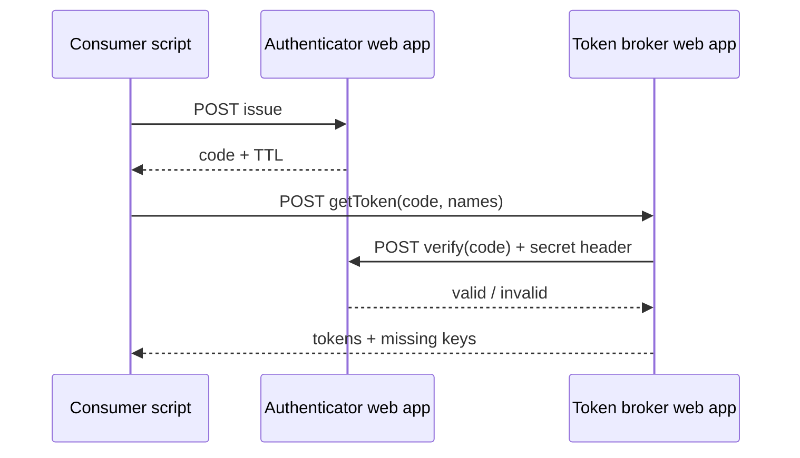

# Token Triangle — Operations & context

Single place for **why this exists**, **how it fits Cairo Confessions**, **what we learned**, and **step-by-step procedures**. Rules for agents and code layout stay in [`AGENTS.md`](./AGENTS.md); a short product spec is in [`SPEC.md`](./SPEC.md).

---

## 1. Context (Cairo Confessions)

**Cairo Confessions (CC)** is an Egyptian community / NGO-style ecosystem (platform, events, mental health adjacent work). This repo folder lives under Atlas as **intelligence / ops docs**, not application source code — GAS source is edited here and pushed with **clasp** to Google.

**Token Triangle** is an internal **challenge → exchange** pattern so automation scripts can use **named secrets** (API keys, tokens) **without** pasting raw secrets into every project or chat:

1. **Authenticator** — issues short-lived **codes** and **verifies** them when the broker asks (with a shared internal secret on the wire).
2. **Token broker** — after verification, returns values from **Script Properties** keyed as `TOKEN_<LOGICAL_NAME>` (e.g. `TOKEN_DEMO`).
3. **Consumers** — any GAS project that includes `TokenClient.js` and points at the two `/exec` URLs.

The deploying Google account for these scripts is **`theoracle@cairoconfessions.com`**; local push uses the **`clasp-cc`** alias (CC clasp profile per Atlas `AGENTS.md`).

---

## 2. Architecture (mental model)



- **Secrets at rest:** only on the **broker** (and any other vault you choose); Authenticator holds **codes in CacheService**, not long-term secrets.
- **Trust boundary:** same **`AUTH_INTERNAL_SECRET`** on Authenticator and broker for verify; consumers only talk HTTP JSON to `/exec` URLs you configure.

---

## 3. Repository layout

| Path | Role |
|------|------|
| `authenticator/src/` | Authenticator: `ENV.js`, `Utils.js`, `AuthApp.js`, optional `SetupTemp.js`, `main.js`, `appsscript.json` |
| `token-broker/src/` | Broker: `ENV.js`, `Utils.js`, `BrokerApp.js`, optional `SetupTemp.js`, `main.js`, `appsscript.json` |
| `sample-caller/src/` | Sample + copy-paste **`TokenClient.js`**, optional `SetupTemp.js`, `main.js`, `appsscript.json` |
| `scripts/` | `tt-deploy-ids.json`, `tt-setup-deploy-urls.mjs` (temporary wiring aid) |
| `tests/` | Jest + `@mcpher/gas-fakes` + `vm` sandboxes (`tests/vm-fakes/`) |

Each subfolder has its own **`.clasp.json`** (script id, `rootDir`, `filePushOrder`).

---

## 4. Script properties (reference)

| Project | Property | Meaning |
|---------|----------|---------|
| **Authenticator** | `AUTH_INTERNAL_SECRET` | Shared secret; broker sends it when verifying; must match broker. |
| **Token broker** | `AUTHENTICATOR_BASE_URL` | Full Authenticator **web app** URL ending in `/exec`. |
| **Token broker** | `AUTH_INTERNAL_SECRET` | Same value as on Authenticator. |
| **Token broker** | `TOKEN_<NAME>` | Secret value for logical name `<NAME>` (e.g. `TOKEN_DEMO`). |
| **Consumer** | `AUTHENTICATOR_URL` | Authenticator `/exec` URL. |
| **Consumer** | `TOKEN_BROKER_URL` | Broker `/exec` URL. |
| **Consumer** (optional) | `DEMO_TOKEN_NAMES` | Comma-separated names for `fetchNamedTokensFromProperties()`. |

---

## 5. Web app URLs and deployment IDs

Stable **web app** URLs look like:

`https://script.google.com/macros/s/<deploymentId>/exec`

Current deployment and script ids are tracked in [`scripts/tt-deploy-ids.json`](./scripts/tt-deploy-ids.json). **Update that file** only if you intentionally create a **new** web app deployment (new URL).

---

## 6. Procedures (clasp)

All commands below assume you **`cd`** into the right project folder (`authenticator/`, `token-broker/`, or `sample-caller/`) unless noted.

### 6.1 Push source to Google

```bash
clasp-cc push --force
```

Use **`--force`** when the remote was edited in the browser or you need to overwrite.

### 6.2 List deployments

```bash
clasp-cc deployments
```

Shows deployment ids and which **version** each points at (`@N`).

### 6.3 Ship a change to live `/exec` (Authenticator & Token broker only)

**Push does not change what the public web app runs** until you snapshot and redeploy:

```bash
clasp-cc push --force
clasp-cc version "short description of change"
clasp-cc deploy -i <webAppDeploymentId> -V <newVersionNumber> -d "human-readable label"
```

`<newVersionNumber>` is the number printed by `clasp-cc version`.  
`<webAppDeploymentId>` is the **same** id as in `tt-deploy-ids.json` (keep the URL stable).

### 6.4 Create new Apps Script projects in a Drive folder

If `.clasp.json` already exists, `clasp create` refuses — temporarily move it aside, then:

```bash
clasp-cc create --title "…" --parentId <folderId> --rootDir src
```

Restore / merge `filePushOrder` from backup, then `clasp-cc push`.

---

## 7. Manifest conventions (`appsscript.json`)

| Setting | Token Triangle choice | Why |
|---------|-------------------------|-----|
| `timeZone` | `Africa/Cairo` | CC operations are Egypt-oriented. |
| `webapp.access` | `DOMAIN` | Only the **same Google Workspace** as the deployer (CC), not the whole internet. |
| `webapp.executeAs` | `USER_DEPLOYING` | Predictable identity for UrlFetch and verification. |
| **`executionApi`** | **Omitted** | We use **web app** deployments only. Adding `executionApi` pushes toward **API executable** + `clasp run` complexity; not required for `/exec`. |

---

## 8. Local testing (Node)

From the Token Triangle folder:

```bash
npm install
npm test
```

- **`@mcpher/gas-fakes`** — real-ish GAS globals on `globalThis` (Utilities, Logger, …).  
- **`tests/vm-fakes/`** — per-test sandbox doubles (Properties, Cache, UrlFetch, `ScriptApp` stub) because project code runs in **`vm`** and must not rely on `globalThis` pollution.  
- Jest needs `NODE_OPTIONS='--experimental-vm-modules'` (set in `package.json` `test` script).

---

## 9. Temporary wiring helper

- **`npm run setup:urls`** (with `TT_AUTH_INTERNAL_SECRET` set) writes **`scripts/generated/tt-manual-script-properties.md`** (gitignored) — paste tables into each project’s Script properties.  
- **`SetupTemp.js`** — optional `_ttSetup*` functions runnable from the **IDE** (Run menu), not via API executable.  
- Remove `SetupTemp.js`, strip from `filePushOrder`, and delete the helper scripts when properties are stable.

---

## 10. Introspection (`getPermission`)

All three projects expose metadata (service id, `scriptId`, auth status, declared oauth scopes). Authenticator and broker: **`GET ?action=getPermission`** or **`POST {"action":"getPermission"}`**. Sample: run **`getPermission()`** in the editor.

---

## 11. Lessons learned (keep these)

1. **Versioned deployments, not HEAD** — Production callers must use the **deployment id** and **version** (`clasp deploy -i … -V …`). Editor “latest” is not what `/exec` runs until you redeploy.  
2. **CC domain access** — Use **`webapp.access`: `DOMAIN`**, not `ANYONE_ANONYMOUS`, when the requirement is Workspace-only.  
3. **Web app vs API executable** — **`webapp`** in the manifest + **Deploy as Web app** = `/exec`. **`executionApi`** in the manifest encourages **API executable** flows and `clasp run`; we removed it to keep ops simple.  
4. **`clasp create` + existing `.clasp.json`** — Rename or move `.clasp.json` first, then create, then merge `filePushOrder`.  
5. **Timezone** — Changing `timeZone` requires a **new version + redeploy** for web apps if you want `/exec` behavior aligned with the manifest snapshot.  
6. **Tests** — GAS code uses UMD `})(this, …)`; Node tests use **vm** + fakes, not `globalThis` for project code.

---

## 12. Troubleshooting

| Symptom | Check |
|---------|--------|
| `/exec` still runs old code | Did you **`version` + `deploy -i`** after `push`? |
| 403 / access denied on `/exec` | `DOMAIN` requires callers to be in the **same Workspace** as the deployer; anonymous internet users cannot use it. |
| `clasp run` fails | We do not rely on it; use web app + paste properties or IDE Run on `SetupTemp`. |
| `clasp create` says “Project file already exists” | Move `.clasp.json` aside first. |

---

## 13. Document index

| File | Contents |
|------|----------|
| [`README.md`](./README.md) | Short overview + links |
| [`AGENTS.md`](./AGENTS.md) | Agent rules: `main.js`, UMD, deploy rules, do-not list |
| [`SPEC.md`](./SPEC.md) | Minimal product / test spec |
| **`OPERATIONS.md`** (this file) | Context, procedures, lessons learned |
| [`tests/`](./tests/) | Jest entry points and `vm-fakes` |

---

## 14. Integration smoke test (optional)

Env vars: deployed `AUTHENTICATOR_URL`, `TOKEN_BROKER_URL`. See [`tests/integration.mjs`](./tests/integration.mjs) (live HTTP, not run in CI by default).
