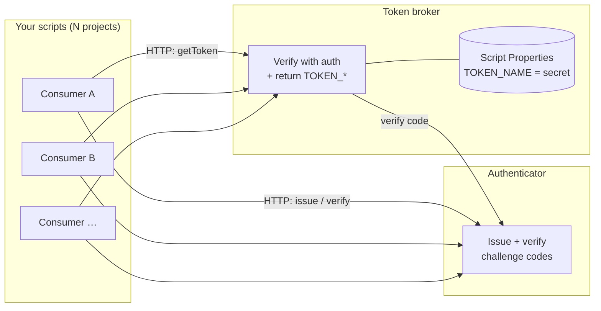
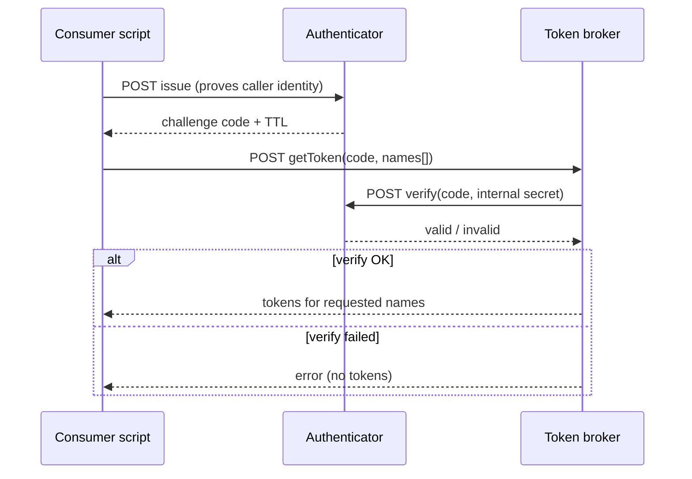
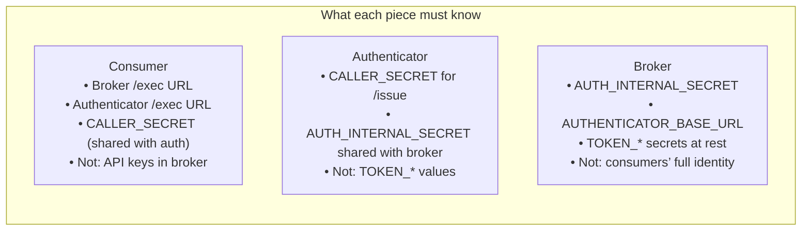

# Token Triangle

A **three-project pattern for Google Apps Script** that lets many automation scripts use **named secrets** (API keys, tokens, connection strings) **without copying those secrets into every project**. Secrets stay in **one place** (the token broker). Other scripts prove they are allowed to fetch them by completing a **short-lived challenge** issued by a separate **authenticator** service.

---

## The problem

In Apps Script you often need the same third-party credentials in several projects (integrations, scheduled jobs, internal tools). Common approaches:

| Approach | Drawback |
|----------|----------|
| Paste the secret into every project | Duplication, rotation pain, higher leak surface |
| One “library” project holding secrets | Still bundles secrets with code that many callers load |
| Share a single Properties store | Hard to scope; easy to over-share |

You want a **controlled handoff**: callers you trust can obtain a **time-bound proof**, and only then the **broker** releases the concrete secret values.

---

## What Token Triangle is

Three small Apps Script deployments that work together:

1. **Authenticator** — Issues **challenge codes** (short TTL, stored in cache) and **verifies** them when asked. It does **not** hold your API keys or product tokens.
2. **Token broker** — Holds the real secrets as **Script Properties** (e.g. `TOKEN_DEMO`, `TOKEN_STRIPE`). It only returns them after it successfully **verifies** the consumer’s challenge with the authenticator.
3. **Consumers** — Your day-to-day scripts. They embed a thin client (see `sample-caller`) that: **issue** → **getToken**. They never need the broker’s secret values at rest in their own project—only **shared gate secrets** configured as properties (documented in `OPERATIONS.md`).

So the name **“triangle”** is literal: three nodes—**consumer**, **authenticator**, **broker**—with a clear split of duties.

---

## Architecture (high level)

**Where secrets live:** only on the **broker** (and whatever backup process you use for Script Properties). The authenticator only stores **ephemeral challenge state** (e.g. cache), not your product API keys.

---

## End-to-end flow (happy path)

The **broker** is the only component that reads `TOKEN_*` properties and returns them. The **authenticator** never sees those values.

---

## Trust boundaries (simplified)

Operational detail (property names, headers, soft gates) is in **[`OPERATIONS.md`](./OPERATIONS.md)** and **[`SPEC.md`](./SPEC.md)**.

---

## Why this is useful

| Benefit | Explanation |
|--------|-------------|
| **Single source of truth** | Rotate or add a secret once on the broker; consumers pick it up on the next successful flow (no redeploy of every script if you only change broker properties). |
| **No secret sprawl** | Third-party keys are not duplicated across every Apps Script project. |
| **Explicit gate** | Every fetch is tied to a **fresh challenge**, not a static long-lived key embedded in each consumer (you still configure shared **caller** and **internal** secrets—see docs). |
| **Fits Apps Script limits** | Uses standard **Web app** `POST` JSON and optional **Execution API** transports; works with `UrlFetchApp` and published deployments. |
| **Testable offline** | This repo includes **Jest** + GAS fakes so you can validate behavior without hitting Google on every run (`npm test`). |

**Trade-offs:** This is **not** zero-trust cryptography. It assumes you protect **URLs**, **Script Properties**, and the **internal shared secret** between authenticator and broker. It is aimed at **internal automation** and **controlled** Apps Script environments, not public internet multi-tenant security without additional layers.

---

## Repository layout

All three clasp projects live under **`apps/`** so the repo root stays tests, scripts, and docs.

| Path | Role |
|------|------|
| [`apps/authenticator/`](./apps/authenticator/) | Challenge issue + verify |
| [`apps/token-broker/`](./apps/token-broker/) | Verify + return named tokens |
| [`apps/sample-caller/`](./apps/sample-caller/) | Reference **`TokenClient.js`** to copy into consumers |
| [`tests/`](./tests/) | Jest tests for the GAS modules |
| [`scripts/tt-deploy-ids.example.json`](./scripts/tt-deploy-ids.example.json) | Template for deployment IDs; copy to `tt-deploy-ids.json` locally (gitignored) |

---

## Quick start (developers)

1. Clone the repo and open each of `apps/authenticator/`, `apps/token-broker/`, and optionally `apps/sample-caller/` as **separate** Apps Script projects (e.g. with [`clasp`](https://github.com/google/clasp)).
2. Configure **Script Properties** and deployments as described in **[`OPERATIONS.md`](./OPERATIONS.md)**.
3. Run **`npm install`** and **`npm test`** at the repo root to validate logic locally.

---

## Further reading

| Document | Contents |
|----------|----------|
| **[`SPEC.md`](./SPEC.md)** | HTTP JSON contracts, transports, return shapes |
| **[`OPERATIONS.md`](./OPERATIONS.md)** | Properties tables, deploy, troubleshooting, subtree mirror workflow |
| **[`AGENTS.md`](./AGENTS.md)** | Conventions for contributors and automation agents |
| **[`CONTEXT.md`](./CONTEXT.md)** | Design notes and lessons learned |

---

## License / usage

Use and adapt this pattern under your own policies. Review security assumptions in **`SPEC.md`** and **`OPERATIONS.md`** before production use.
